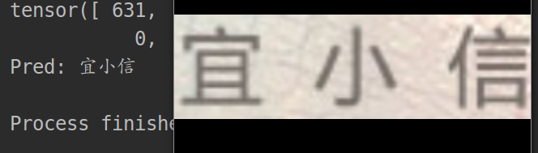

# CRNN.Pytorch
Pytorch CRNN for text recognition, MobileNetv3 + CTC loss.

支持不定长标签数据训练和识别,主要改进点：

- MobileNetv3提取特征
- 支持不定长标签训练
- 支持中文训练
- 数据增强，多尺度训练等

## Dataset

使用[中文场景文字识别技术创新大赛_训练集](https://aistudio.baidu.com/aistudio/datasetdetail/8429)训练.

图片和标签格式保留原始数据集格式：

标签文件train.list内容如下：

```
192	48	img_200000.jpg	本座３楼电话：３４３２８２９１　８４２７１０７９
87	48	img_200001.jpg	曼天雨
205	48	img_200002.jpg	辰饰靓点
133	48	img_200003.jpg	夏季促销
104	48	img_200004.jpg	曼天雨
...
```

## Train

set config in crnn_train.py and run:

```
python crnn_train.py
```

```
Epoch: [2][1530/1558]	LR: 0.001	Time 0.108s (0.069s)	Speed 590.9 samples/s	Data 0.000s (0.000s)	 Loss 0.04234 (0.38355)	
Epoch: [2][1540/1558]	LR: 0.001	Time 0.057s (0.069s)	Speed 1117.5 samples/s	Data 0.000s (0.000s)	 Loss 0.12645 (0.38193)	
Epoch: [2][1550/1558]	LR: 0.001	Time 0.098s (0.069s)	Speed 650.2 samples/s	Data 0.000s (0.000s)	 Loss 0.04381 (0.38010)	
Epoch: [2][19/27]
---------等-----多----了-----品-----等---经------机--有 => 等多了品等经机有            , gt: 等多了品等经机有            
---------过----用-----以-----业----实------我---场---人 => 过用以业实我场人            , gt: 过用以业实我场人            
--------全-----机------以----开-----用---一------制--法 => 全机以开用一制法            , gt: 全机以开用一制法            
----------报---年------以-----力----中-----同----开--长 => 报年以力中同开长            , gt: 报年以力中同开长            
--------合------大----有-----进----不-----关-----要--高 => 合大有进不关要高            , gt: 合大有进不关要高            
----------生-----多----时----个-----就----公----业---制 => 生多时个就公业制            , gt: 生多时个就公业制            
----------万----前-----不----有----公-----本-----了--重 => 万前不有公本了重            , gt: 万前不有公本了重            
----------后----年----有-----生-----自-----用------不们 => 后年有生自用不们            , gt: 后年有生自用不们            
---------民-----发-----不----市----过-----制-----长--区 => 民发不市过制长区            , gt: 民发不市过制长区            
----------长----下-----在-----时----的---要------社--上 => 长下在时的要社上            , gt: 长下在时的要社上            
[#correct:1498 / #total:1728]
Test loss: 0.1210, accuray: 0.8669
is best: True
best acc is: 0.8668981481481481
Epoch: [3][0/1558]	LR: 0.001	Time 0.277s (0.277s)	Speed 231.0 samples/s	Data 0.194s (0.194s)	 Loss 0.07405 (0.07405)	
Epoch: [3][10/1558]	LR: 0.001	Time 0.048s (0.092s)	Speed 1346.3 samples/s	Data 0.000s (0.018s)	 Loss 0.25274 (0.20305)
```

## Train with custom data

arrange label file as：

```
train_0.jpg 行重人等来市
train_1.jpg 一于者报一市
train_2.jpg 公到民
train_3.jpg 要就他日企和
train_4.jpg 体不化出产学加多场
train_5.jpg 现部制就展市
train_6.jpg 同以市
train_7.jpg 出多企产方
train_8.jpg 部定日学中中多就中
```

change line 31 in dataloadershuffle.py:

```
self.labels = [{c.split()[2]: c.split()[3]} for c in file.readlines()]
```

to

```
self.labels = [{c.split()[0]: c.split()[1]} for c in file.readlines()]
```

## Demo

see demo.py




